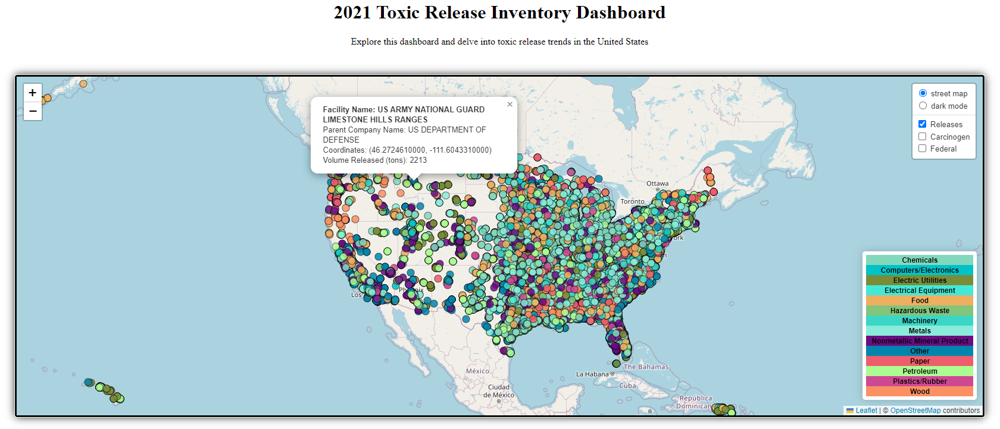
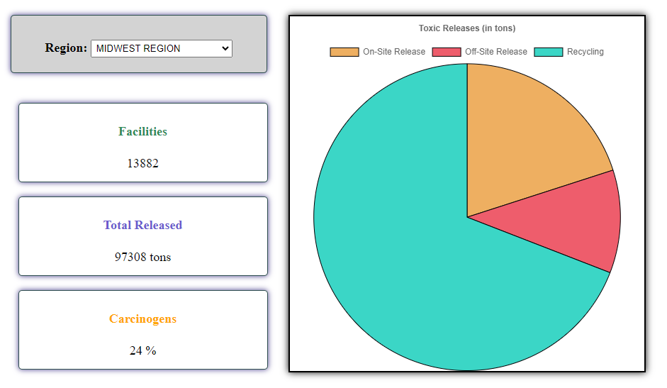
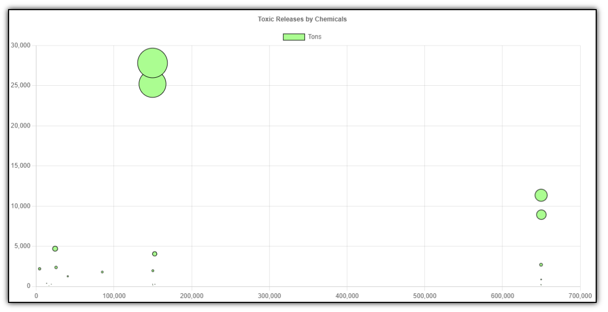
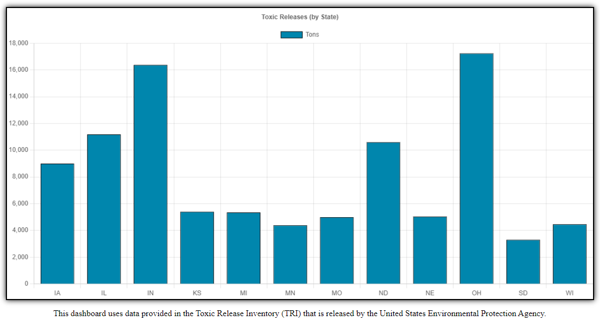

# Project-03
Project 3

### PROJECT TITLE

"An Exploration into Toxic Releases in the United States"
____________________________________________________________

### TEAM MEMBERS

- Leah Latham
- Chase Scarboro
- Adrian Sandoval
- Hannah Carnes

____________________________________________________________

### PROJECT DESCRIPTION:

We are exploring trends in toxic releases across the United States, specifically looking at industry types, location of releases, presence of carcinogens, and types of chemicals or metals released.

____________________________________________________________

### KEY AREAS TO ADDRESS:

1. The relationship between industry type and toxic release volume and location, with the ability to filter by presence of carcinogens and federal companies (map)
2. By region (including Tribal Lands), comparing number of factories, total release volumes, and percent of carcinogens (table)
3. By region (including Tribal Lands), comparing the unique chemical profiles released as well as the breakdown of onsite, offsite, and recycling volumes and total volumes by state (bubble/pie/bar)

____________________________________________________________

### DATASET(s)/API(S) TO BE USED:

- 2021 Toxic Release Inventory (https://www.epa.gov/toxics-release-inventory-tri-program/tri-basic-data-files-calendar-years-1987-present)

____________________________________________________________

### INCLUDED IN THIS REPOSITORY:

- Output folder containing the following:
    - 4 .csv files created from Jupyter Notebook cleaning (to be used for SQL database)
    - Json folder containing JSON formatted files for reference
    - Images folder containing screenshots for README
- Path folder containing the following:
    - chart.js = for bubble/bar creation
    - logic.js - for map/pie creation
    - style.css - for formatting
- Resources folder containing the following:
    - 2021_us.csv file - original data source from EPA
    - tri_documentation.pdf - information on column titles/contents
    - us-regions-map.jpg - for reference for regional divisions
- cleaning_data.ipynb - Jupyter Notebook which narrows and cleans data
- flask_app.py - Flask API for cleaned data / Leaflet map
- index.html - html to present dashboard
- presentation.pptx - for class presentation
- schema.sql - SQL table schema
- tri_database.sqlite - sqlite file for Flask
- tri_js.js - js file containing dictionary for chart.js (pie/bubble/bar)
- tri_json.json - json file created from Jupyter notebook, converted to JS (see tri_js.js)

____________________________________________________________

### REFERENCES / RESOURCES

- Regional map - https://www.mappr.co/political-maps/us-regions-map/
- TRI file documentation descriptions - https://www.epa.gov/system/files/documents/2022-10/TRI_Basic_Data_File_Documentation_RY2021_102522.pdf
- CSS aligning - https://www.w3schools.com/css/css_align.asp
- Borders - https://blog.hubspot.com/website/css-border#:~:text=CSS%20Border%20Not%20Showing,not%20define%20the%20border%20style
- Combine elements in single row - https://stackoverflow.com/questions/61637178/how-to-center-multiple-figure-elements-in-one-row
- Creating a SQLITE file - https://sqlitebrowser.org/dl/ and https://datacarpentry.org/sql-socialsci/02-db-browser.html

____________________________________________________________

### ANALYSIS

- Our cleaning and preparation steps followed this path: 
    - original .csv --> Jupyter notebook .ipynb cleaning --> 4 new .csv files to SQL database --> 1 new .sql schema to SQLITE database --> 1 .sqlite file to Flask API --> HTML/CSS --> 2 JavaScript .js files

- During this process we identified areas that appeared to warrent further exploration, and we dug into the data in an attempt to address these questions, which are listed below.

### 1. What is the relationship between industry type, toxic release volume, location, presence of carcinogens, and federal companies?

We explored this question by creating an interactive Leaflet map that filtered for total releases, only releases with carcinogens, and only federal companies.  We also included a pop-up containing the facility name, parent company name, coordinate location, and total volume toxic release in tons.  This allows for broad review or an in-depth look at certain locations or industries.

### 2. How do toxic releases vary when comparing number of factories, total release volumes, and percent of carcinogens by region?  
### 3. What is the breakdown between on-site, off-site, and recycling toxic releases?

We explored this data by grouping the data by region and updating the table based on the desired region.  This data did pull out Tribal Land in addition to the standard regions (West, Southwest, Midwest, Southeast, and Northeast).  We found that while the Midwest region had the most Facilites at 13,882, the Southeast region had--by far--the highest volume released at 155,644 tons. The Tribal Lands have the smallest number of facilities at 168, but all regions had between 24%-26% of their on-site releases containing carcinogens.  Somewhat unexpectedly, the majority of the releases seen were off-site recycling.

### 4. How do the unique chemical profiles and total volumes broken down by state vary within each region?

We explored this data by creating charts with chart.js and identifying the total volumes for each chemical for the region and then the total volume by state.  This allowed us to view overall variations by region, in contrast to the map, which was very specific.
____________________________________________________________

### FURTHER STUDY

There was an abundance of data in this dataset and many different avenues to dig into that data.  We reviewed the total toxic releases but the data also included breakdowns for air, water, and ground releases.  One potential area of further study we discussed would be to compare the different types of releases with potential health conditions in the same area.  For instance, in areas with a high concentration of air releases, do those communities also see higher rates of respiratory illnesses?
____________________________________________________________

### CONCLUSION

Creating and utilizing this dashboard has been very educational.  We have learned more about the toxic chemicals that are released around us, which chemicals are prevalent, what types of companies and industries are releasing these chemicals, which areas have high concentrations, and how many carcinogens are present.  We hope that this dashboard can be a source of exploration for you as well.